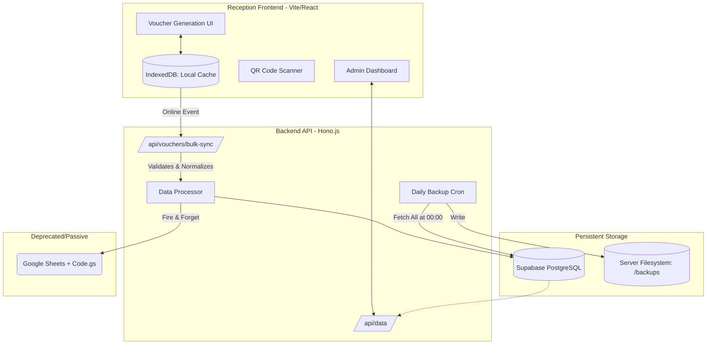
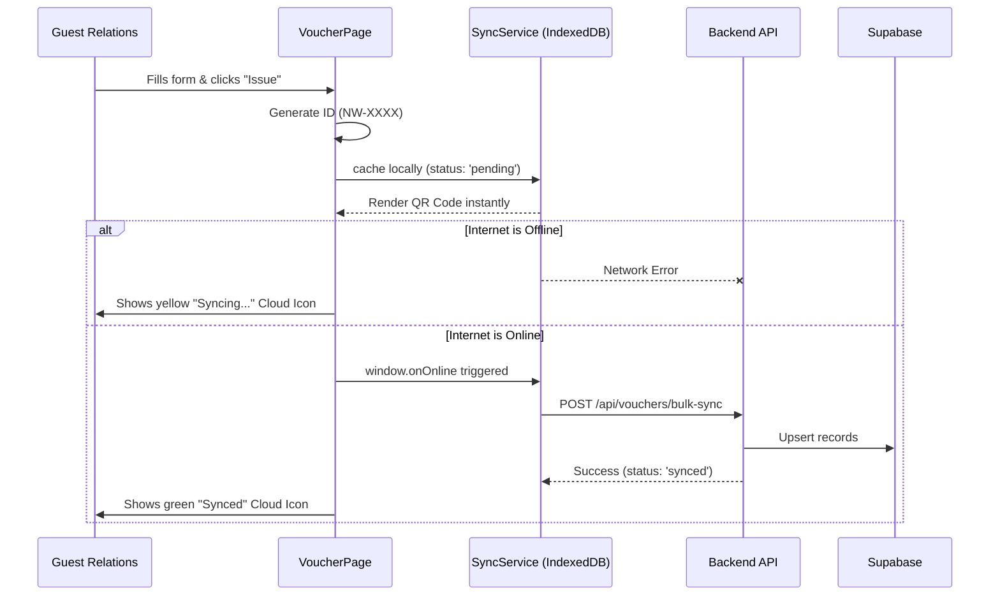
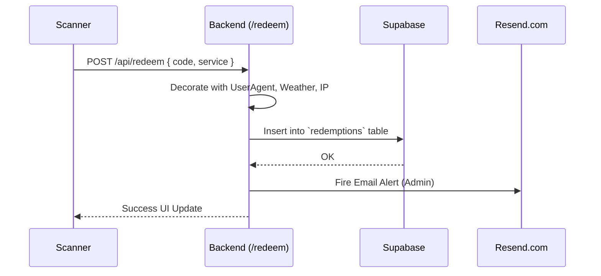

# Wellness Club Digital: System Architecture & Operations Manual
*Version 3.0: Professional HMS & Marketing Pillar*

This document outlines the architecture, features, and operational flows of the refactored Wellness Club Digital Voucher System.

---

## 1. System Overview & Key Features

The new system moves away from a fragile dependency on Google Sheets into a robust, "Server-Side Truth" architecture backed by Supabase and a Node.js (Hono) backend, while the frontend (Vite + React) acts as a highly resilient offline-first client.

### Core Features
*   **Local-First Sync Engine**: Guest Relations Officers (GROs) can issue vouchers even if the hotel Wi-Fi goes down. Vouchers are cached securely in the browser's IndexedDB and automatically pushed to the server when the connection is restored.
*   **Marketing & CRM Ready**: Vouchers now capture `qr_source_location` (Attribution) and `marketing_consent` (GDPR), turning the system into a lead-generation funnel for a future Hotel Management System (HMS).
*   **Admin Management Dashboard**: A blazing-fast, server-synced data grid (built with TanStack Table) allows management to filter by date, venue, status, and export auditable CSVs instantly.
*   **Daily Air-Gapped Backups**: A CRON-triggered script automatically pulls the entire database at midnight and writes it to a physical JSON file on the server's disk for 100% disaster recovery compliance.
*   **Legacy Passive Observation**: Google Sheets still receives a mirrored copy of the data in the background (fire-and-forget), acting as an emergency read-only viewer for staff used to the old system.

---

## 2. High-Level Architecture Diagram



---

## 3. Directory & Repository Structure

The repository is built as a monorepo containing both the Frontend UI and Backend API.

```text
Wellness-Club-Digital/
├── apps/
│   ├── api/                      # Backend Service (Hono.js)
│   │   ├── src/
│   │   │   ├── app.ts            # Main API Router
│   │   │   ├── db.ts             # Supabase Client Initializes
│   │   │   ├── routes/
│   │   │   │   ├── bulk-sync.ts  # Handles offline-to-online uploads
│   │   │   │   ├── data.ts       # Supplies Admin Dashboard
│   │   │   │   ├── redeem.ts     # Handles QR code redemptions
│   │   │   │   ├── backups.ts    # API to download daily backups
│   │   │   │   └── cron/
│   │   │   │       └── daily-backup.ts # Automated nightly JSON exports
│   │   └── ...
│   │
│   ├── web/                      # Frontend Client (Vite + React)
│   │   ├── src/
│   │   │   ├── VoucherPage.tsx   # Core GRO issuing screen
│   │   │   ├── components/
│   │   │   │   ├── AdminDashboard.tsx     # High-level Insights UI
│   │   │   │   ├── AnalyticsDashboard.tsx # Lower-level performance UI
│   │   │   │   └── ...
│   │   │   ├── services/
│   │   │   │   └── SyncService.ts# IndexedDB Local-First Engine
│   │   │   └── ...
│   │
├── backups/                      # Auto-generated JSON files (Server)
├── Code.gs                       # Legacy Google Apps Script Webhook
└── ...
```

---

## 4. Operation Mapping & Flows

### Flow A: Creating a Voucher (The "Zero-Loss" Flow)
This flow guarantees that a voucher is never lost to poor connectivity ("Ghost Voucher" prevention).



### Flow B: Redeeming a Voucher


---

## 5. Schema Upgrades & CRM Mapping

The database now acts as the central source of truth, structured to integrate cleanly into a future Enterprise HMS. 

### Core Voucher Schema (`vouchers` table / Prisma Alignment)

| Field | Type | Description / CRM Purpose |
| :--- | :--- | :--- |
| `voucher_code` | `VARCHAR` | Unique ID (e.g. `NW-X7Z2`). Primary Key. |
| `guest_name` | `TEXT` | Full name string. |
| `room_number` | `VARCHAR` | Identifier for hotel mapping. |
| `check_in` / `out` | `DATE` | Stay duration mapping. |
| `pax` | `INT` | Number of guests attached to the pass. |
| `services` | `TEXT` | Comma-separated list of selected services. |
| **`qr_source_location`** | `TEXT` | **[NEW]** How the guest found us (e.g., `reception`, `villa-qr`). |
| **`marketing_consent`** | `BOOLEAN` | **[NEW]** Essential for GDPR/CRM email tracking. |
| **`sync_status`** | `VARCHAR` | **[NEW]** Tracks if generated offline (`pending`, `synced`). |
| `image_url` | `TEXT` | URL to the guest's uploaded image. |
| `is_test` | `BOOLEAN` | Flag for test vouchers. |
| `created_at` | `TIMESTAMPTZ` | Exact audit boundary timestamp. |

---

## 6. Daily Backup Strategy (The "Paper Trail")

The system provides an automated backup mechanism:
1. **Endpoint**: `/api/cron/daily-backup` (Protected by `CRON_SECRET`).
2. **Execution**: It pulls `SELECT * FROM vouchers`, stringifies it, and writes to `/backups/voucher_backup_YYYY-MM-DD.json`.
3. **Trigger**: Intended to be called by an external cron job (e.g., GitHub Actions, EasyCron, or a server-side crontab).
4. **Manual Override**: Management can trigger a manual backup via the Admin panel if needed.
